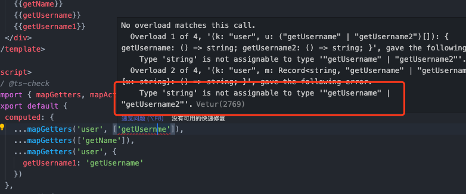
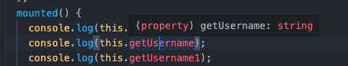
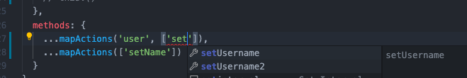
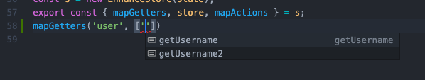
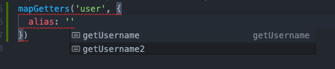
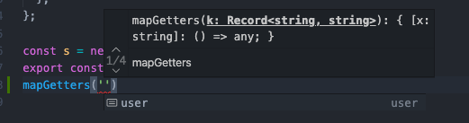

# vuex-ts-enhance

enhance types from vuex

it will check `mapXXXX()` params for `state`, `getters`, `actions`, `mutations` in store

but `dispatch` is different

```typescript
const state = {};
const s = new EnhanceStore(state);
export const { dispatch } = s;
dispatch('rootAction')('payload');
dispatch('namespace', 'action')('payload');
```


## Example

[state](./dev/store.ts)

**check for typescript**



**check for return type**



**tips from vscode**






## Usage

use `EnhanceStore` to create `store`

```ts
import { EnhanceStore } from 'vuex-ts-enhance';
import Vuex from 'vuex';
import Vue from 'vue';
Vue.use(Vuex);

// state cannot be declared
const state = {
  // your state
};
const s = new EnhanceStore(state);
export const {
  mapGetters,
  store,
  mapActions,
  dispatch,
  mapState,
  mapMutations,
} = s;
```

```html
<template>
  <div>
    {{getName}} {{getUsername}} {{getUsername1}}
  </div>
</template>

<script>
  // @ts-check
  import { mapGetters, mapActions, dispatch } from './store';
  export default {
    computed: {
      ...mapGetters('namespace', ['namespaceGetter']), // will check type
      ...mapGetters(['getter1']),
      ...mapGetters('namespace', {
        getterAlias: 'namespaceGetter',
      }),
    },
    mounted() {
      console.log(this.namespaceGetter);
      console.log(this.getter1);
      console.log(this.getterAlias);
      this.namespaceAction;
      this.action1;
      dispatch('namespace', 'namespaceAction')('payload');
      dispatch('action1')('payload');
    },
    methods: {
      ...mapActions('namespace', ['namespaceAction']),
      ...mapActions(['action1']),
    },
  };
</script>
```

**Note**
if write in js and your `getter` or `actions` is empty, you must to declare it

```js
// store.js
/**
 * @constant
 * @type {import('vuex').GetterTree}
 */
const getters = {};
/**
 * @constant
 * @type {import('vuex').ActionTree}
 */
const actions = {};
/**
 * @constant
 * @type {import('vuex').MutationTree}
 */
const mutations = {};
```

## Notice

- You can't defined `state` as `StoreOptions`

```typescript
const state: StoreOptions<any> = {}; // don't do that
```

- You must be defined `context` as `any` if use `jsdoc` for types

```javascript
const state = {
  actions: {
    /**
     * @param {any} context
     * @param {string} payload
     */
    someActions(context, payload) {},
  },
};
```

## develop

- `git clone project`
- `yarn dev`
- edit dev files
- add test case
